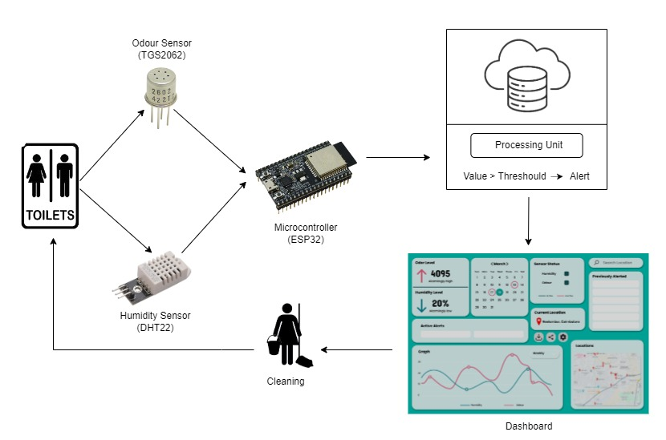
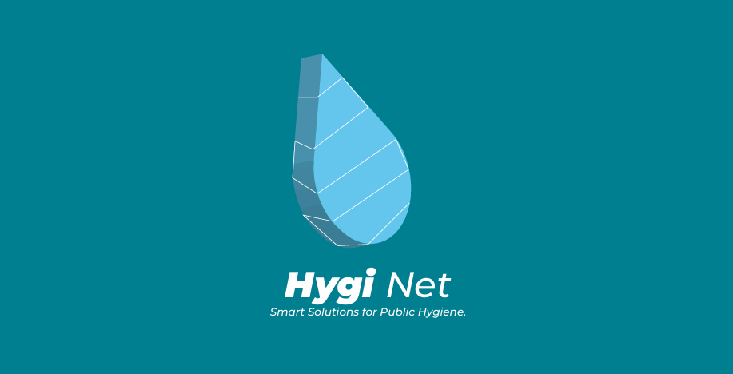

# IoT-Based Toilet Management System

## Description

The **Real-Time IoT-Based Toilet Health Monitoring System** is an innovative solution to monitor humidity and odor levels within a toilet cubicle using an IoT-based system powered by the **ESP32**. The system provides real-time data, accessible remotely via the cloud, to ensure hygiene levels are maintained. The system features an alert mechanism with two levels:

- **First Level Alert**: Activated when sensor readings exceed set thresholds but only for 30 minutes and after three successive occurrences.
- **Second Level Alert**: Triggered when critical humidity or odor values are detected, signaling the need for immediate action.

The system displays real-time data (humidity, odor level, and time) on a **ThinkSpeak** dashboard. Maintenance personnel receive hygiene alerts to prompt cleaning actions. The system also includes a disinfectant spray mechanism that ensures the spray is only activated when the restroom is unoccupied. Furthermore, an integrated **GPS module** ensures precise location tracking.

## Features

- **Real-Time Monitoring**: Tracks humidity and odor levels in the toilet cubicle.
- **Two-Level Alert System**: Alerts for hygiene issues based on sensor thresholds.
- **Cloud Integration**: View real-time data through **ThinkSpeak**.
- **Disinfectant Mechanism**: Controls disinfectant spray based on sensor readings and occupancy.
- **Location Tracking**: GPS module for accurate location monitoring.
- **Wi-Fi Connectivity**: Easy access to data remotely.

### Block Diagram

## Software Libraries

- **Adafruit Unified Sensor Library**: To interface with the DHT22 sensor.
- **My Sensor Library**: For Wi-Fi connection functionality.
- **Thingspeak Library**: To display output on the **ThinkSpeak** platform.

## Setup Instructions

### Prerequisites

- **Hardware**: ESP32, DHT22, TGS2062, GPS module.
- **Software**: Arduino IDE or similar platform for ESP32 development.

### Steps

1. **Install Required Libraries**:
    - Adafruit Unified Sensor Library
    - My Sensor Library for Wi-Fi
    - Thingspeak Library

2. **Hardware Wiring**:
    - Connect the **DHT22** sensor to the ESP32.
    - Connect the **TGS2062** odor sensor to the ESP32.
    - Connect the **GPS Module** to the ESP32.

3. **Upload the Code**:
    - Open the **Arduino IDE**.
    - Select **ESP32** as the board.
    - Set up the **Wi-Fi** credentials in the code.
    - Upload the code to the **ESP32** board.

4. **Viewing Data**:
    - Once the system is set up and running, the data will be transmitted to **ThinkSpeak** where you can view real-time values for **humidity** and **odor**.
    - The serial monitor will display the connected **Wi-Fi**, current **humidity level**, **odor value**, and whether cleaning is required.

### Configuration

- **Wi-Fi Delay**: Set to **15 seconds** for a delay between data readings.
- **Threshold Values**: Adjustable to control when alerts are triggered.

## Usage

Once the system is set up, it will monitor the humidity and odor levels in the toilet cubicle and send data to **ThinkSpeak**. You can access the dashboard remotely to check the real-time values. Maintenance personnel will receive alerts via the system whenever cleaning is required 🚨🧽.

